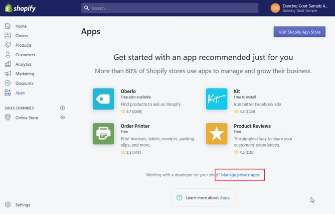
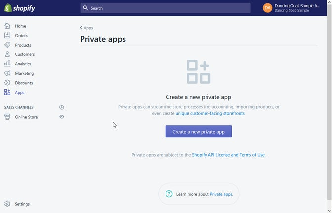

[![Core integration][core-shield]](https://kontent.ai/integrations/bynder)
[![Gallery][gallery-shield]](https://kentico.github.io/kontent-custom-element-samples/gallery/)

![Last modified][last-commit]
[![Issues][issues-shield]][issues-url]
[![Contributors][contributors-shield]][contributors-url]
[![Forks][forks-shield]][forks-url]
[![MIT License][license-shield]][license-url]

[![Stack Overflow][stack-shield]](https://stackoverflow.com/tags/kentico-kontent)
[![GitHub Discussions][discussion-shield]](https://github.com/Kentico/Home/discussions)

<p align="center">
<image src="docs/01-kk-logo-main.svg" alt="kontent logo" width="300" />
<image src="docs/shopify-logo.png" 
alt="shopify logo" width="200">
</p>

<p align="center">
  <a href="#features">Features</a> •
  <a href="#demo">Demo</a> •
  <a href="#quick-deploy">Deploy</a> •
  <a href="#configuring-the-custom-element">Configuration</a> •
  <a href="#what-is-saved">Saved value</a> •
  <a href="#contributors">Contributors</a> •
  <a href="#license">License</a> •
  <a href="#additional-resources">Resources</a>
</p>

This  [custom element](https://docs.kontent.ai/tutorials/develop-apps/integrate/integrating-your-own-content-editing-features) allows the user to search and link products from their [Shopify](https://shopify.com/) store into [Kentico Kontent Headless CMS](https://kontent.ai).

## Features

- Editors can
  - Search for products in Shopify e-commerce platform
  - Select a single product (or one of it's variants)
  

## Demo

![Demo Animation][product-demo]

## Quick Deploy

Netlify has made this easy. If you click the deploy button below, it will guide you through the process of deploying it to Netlify and leave you with a copy of the repository in your account as well.

[](https://app.netlify.com/start/deploy?repository=https://github.com/Kentico/kontent-custom-element-shopify)


## Shopify configuration
In order to use this extension, you'll need to create a [Private App](https://help.shopify.com/en/manual/apps/private-apps) in your Shopify store. This allows for the integration to connect into your product catalog through the [Storefront API](https://shopify.dev/docs/storefront-api) to search for products. Don't worry it's very simple. 

1. Navigate to your **Shopify admin** and select **Apps** from the main menu. Click **Manage private apps**.



2. On the next screen, click **Create a new private app**.


3. Enter the following information:
- **Private app name** – Kentico Kontent Product selector
- **Emergency developer email** – Your e-mail
- **Admin API permissions** – No access for all options as the selector will leverage only the public Storefront API
- **Storefront API** – Select Allow this app to access your storefront data using the Storefront API
- **Storefront API permissions** – Select only Read products, variants, and collections as you only need to read products in the product selector


4. Submit the form and notice two things that you will need to configure the Product selector to access the Shopify API:

- **Your e-shop's domain** – This is shown in your browser's address bar, in our case it is https://dancing-goat-sample.myshopify.com, with _dancing-goat-sample_ being the name of the store.
- **The Storefront access token** – This is at the **very bottom** of the form so that you can authenticate requests against the Storefront API.

That's it, you are now ready to configure your custom element inside of the Kontent application.

## Configuring the Custom Element
You will also need to provide the following JSON parameters for the custom element to connect to your store. Replace the placeholders with the actual values from the setup process above.

```json
{
  "storeFrontAccessToken": "<YOUR STOREFRONT ACCESS TOKEN>",
  "apiEndpoint": "https://<YOUR STORE NAME>.myshopify.com/api/graphql"
}
```

## What is Saved
The selector stores the following value format in JSON, which it also uses to display the selected product on first load:

```json
{
  "id": "Z2lkOi8vc2hvcGlmeS9Qcm9kdWN0LzE3MzQ0NjA2MzcyMTg=",
  "handle": "aeropress",
  "title": "AeroPress",
  "previewUrl": "https://cdn.shopify.com/s/files/1/0048/8679/0178/products/aeropress.jpg?v=1551277741",
  "sku": "BR-01"
}
```
The fields are:

- **id** – The internal ID of the product in Shopify; can be used for further API calls to get product data.
- **handle** – A similar value to a URL Slug in Kentico Kontent; it's used within the product URL.
- **title** – The name of the product.
- **previewUrl** – The primary (featured) image for the product.
- **sku** – The SKU for the product; taken from the first product variant.

You can use any of those values for both admin UI or in your project. Should you need to make more fields available, you can do so by customizing the code of the custom element.

The selector also currently supports only a single selection. If you need to link multiple products, you can update the code, wrap the output value in an array and adjust the rendering code accordingly.


## Contributors

<a href="https://github.com/Kentico/kontent-custom-element-shopify/graphs/contributors">
  
</a>

We have collected notes on how to contribute to this project in [CONTRIBUTING.md](CONTRIBUTING.md).

## License

[MIT](https://tldrlegal.com/license/mit-license)

## Additional Resources

- [Custom Element Gallery on github](https://kentico.github.io/kontent-custom-element-samples/gallery/)
- [Kentico Kontent's Integration documentation](https://docs.kontent.ai/tutorials/develop-apps/integrate/integrations-overview)
- [Custom Element documentation](https://docs.kontent.ai/tutorials/develop-apps/integrate/content-editing-extensions)
- [Custom Element API reference](https://docs.kontent.ai/reference/custom-elements-js-api)


[last-commit]: https://img.shields.io/github/last-commit/Kentico/kontent-custom-element-shopify?style=for-the-badge
[contributors-shield]: https://img.shields.io/github/contributors/Kentico/kontent-custom-element-shopify.svg?style=for-the-badge
[contributors-url]: https://github.com/Kentico/kontent-custom-element-shopify/graphs/contributors
[forks-shield]: https://img.shields.io/github/forks/Kentico/kontent-custom-element-shopify.svg?style=for-the-badge
[forks-url]: https://github.com/Kentico/kontent-custom-element-shopify/network/members
[stars-shield]: https://img.shields.io/github/stars/Kentico/kontent-custom-element-shopify.svg?style=for-the-badge
[stars-url]: https://github.com/Kentico/kontent-custom-element-shopify/stargazers
[issues-shield]: https://img.shields.io/github/issues/Kentico/kontent-custom-element-shopify.svg?style=for-the-badge
[issues-url]: https://github.com/Kentico/kontent-custom-element-shopify/issues
[license-shield]: https://img.shields.io/github/license/Kentico/kontent-custom-element-shopify.svg?style=for-the-badge
[license-url]: https://github.com/Kentico/kontent-custom-element-shopify/blob/master/LICENSE
[core-shield]: https://img.shields.io/static/v1?label=&message=core%20integration&style=for-the-badge&color=FF5733
[gallery-shield]: https://img.shields.io/static/v1?label=&message=extension%20gallery&style=for-the-badge&color=51bce0
[stack-shield]: https://img.shields.io/badge/Stack%20Overflow-ASK%20NOW-FE7A16.svg?logo=stackoverflow&logoColor=white&style=for-the-badge
[discussion-shield]: https://img.shields.io/badge/GitHub-Discussions-FE7A16.svg?logo=github&style=for-the-badge
[product-demo]: docs/demo.gif?raw=true
